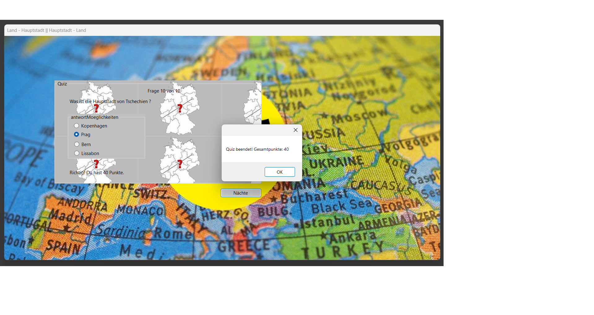

# QuizSoftware - (CSharp-OOP)

Eine C# Windows Forms Anwendung zum spielerischen Lernen von Ländern, Hauptstädten und Flaggen mit MySQL-Datenbankanbindung.

## Beschreibung

Das GeographieQuiz-System ermöglicht es Ihnen:
- **Benutzerverwaltung** mit Login und Registrierung
- **Verschiedene Quiztypen** (Land-Flagge, Land-Hauptstadt, Hauptstadt-Land, Flagge-Land)
- **Kontinentbasierte Fragen** aus Europa, Asien, Afrika, Nord-/Südamerika und Australien
- **Punktesystem** mit Highscore-Tracking
- **Statistische Auswertung** der Spielergebnisse
- **Übersichtliche Darstellung** mit visuellen Flaggen und interaktiver Benutzeroberfläche

## Technologie-Stack

- **Framework**: .NET 8.0 Windows Forms
- **Programmiersprache**: C#
- **Datenbank**: MySQL/MariaDB
- **IDE**: Visual Studio
- **OOP-Prinzipien**: Klassen für Spieler, Quiz, Landinfo, Punkte und HoechstePunktzahl

## Datenbankstruktur

Das System verwendet eine MySQL-Datenbank mit folgenden Tabellen:

### Tabellen:
- **`spieler`** - Speichert Benutzerdaten
  - `spielerid` (Primary Key, AUTO_INCREMENT)
  - `spielername` (VARCHAR 100)
  - `passwort` (VARCHAR 15)

- **`landinfo`** - Speichert geografische Informationen
  - `landID` (Primary Key, AUTO_INCREMENT)
  - `land` (Ländername)
  - `hauptstadt` (Hauptstadt des Landes)
  - `flagge` (Flaggen-Dateiname)
  - `kontinent` (Kontinentzugehörigkeit)

- **`quiz`** - Speichert Quizdurchläufe
  - `quizID` (Primary Key, AUTO_INCREMENT)
  - `spielerID` (Foreign Key zu spieler)
  - `quizTyp` (Art des Quiz)
  - `gesamtPunkte` (Erzielte Punkte)

- **`punkte`** - Verknüpfungstabelle für Punktevergabe
  - `punkteID` (Primary Key, AUTO_INCREMENT)
  - `spielerID` (Foreign Key zu spieler)
  - `quizId` (Foreign Key zu quiz)
  - `gesamtPunkte` (Punkte des Durchlaufs)

### View:
- **`v_hoechste_punktzahl`** - Zeigt die höchste Punktzahl pro Spieler

## Quiztypen

Das System bietet vier verschiedene Quiztypen:
1. **Land-Flagge**: Ländername wird angezeigt, Flagge muss erraten werden
2. **Flagge-Land**: Flagge wird angezeigt, Ländername muss erraten werden
3. **Land-Hauptstadt**: Ländername wird angezeigt, Hauptstadt muss erraten werden
4. **Hauptstadt-Land**: Hauptstadt wird angezeigt, Ländername muss erraten werden

## Objektorientierten Klassen

### Hauptklassen:
- **`Spieler`**: Verwaltet Spielerdaten (ID, Name, Passwort)
- **`Quiz`**: Repräsentiert einen Quizdurchlauf
- **`Landinfo`**: Enthält geografische Informationen
- **`Punkte`**: Verwaltet Punktestände
- **`HoechstePunktzahl`**: Tracking der Bestleistungen
- **`Datenbank`**: Datenbankverbindung und -operationen

## Installation und Setup

### Voraussetzungen:
- .NET 8.0 SDK oder höher
- MySQL/MariaDB Server
- Visual Studio 2022 oder höher

### Schritt-für-Schritt Installation:

1. **Repository klonen**
   ```bash
   git clone [repository-url]
   cd QuizSoftware
   ```

2. **Datenbank einrichten**
   - MySQL/MariaDB Server starten
   - Datenbank erstellen:
     ```sql
     CREATE DATABASE quizsoftware;
     ```
   - SQL-Datei importieren:
     ```bash
     mysql -u root -p quizsoftware < quizsoftware.sql
     ```

3. **Datenbankverbindung konfigurieren**
   - Öffnen Sie `Datenbank.cs`
   - Passen Sie die Verbindungszeichenfolge an:
     ```csharp
     private string connstr = "SERVER=localhost; UID='root';PASSWORD='IhrPasswort';DATABASE=quizsoftware";
     ```

4. **Projekt kompilieren und ausführen**
   
   **Option A: Mit .NET CLI (Command Line)**
   ```bash
   dotnet restore    # Lädt alle NuGet-Pakete herunter
   dotnet build      # Kompiliert das Projekt
   dotnet run        # Startet die Anwendung
   ```
   
   **Option B: Mit Visual Studio (Empfohlen für Windows Forms)**
   - Öffnen Sie `QuizSoftware.sln` in Visual Studio
   - Drücken Sie `F5` oder klicken Sie auf "Starten"
   - Visual Studio führt automatisch Build und Start aus

## Verwendung

### 1. Benutzeranmeldung
- **Registrierung**: Neuen Benutzernamen und Passwort eingeben, "Registrieren" klicken
- **Anmeldung**: Bestehende Anmeldedaten eingeben, "Anmelden" klicken

### 2. Quiz starten
- Quiztyp aus der Dropdown-Liste auswählen
- Kontinent für die Fragen auswählen
- "Quiz starten" klicken

### 3. Quiz spielen
- Fragen werden nacheinander angezeigt
- Bei Multiple-Choice-Fragen richtige Antwort auswählen
- Punkte werden automatisch berechnet (4 Punkte pro richtige Antwort)

### 4. Statistiken einsehen
- **Eigene Ergebnisse**: Übersicht aller gespielten Quiz
- **Highscores**: Bestleistungen aller Spieler
- **Detailansicht**: Punkteverteilung nach Quiztypen

## Spielregeln

- **Punktevergabe**: 4 Punkte pro richtige Antwort
- **Fragenanzahl**: 10 Fragen pro Quiz
- **Maximalpunktzahl**: 40 Punkte pro Quiz
- **Kontinentfilter**: Fragen können nach Kontinenten gefiltert werden
- **Zufallsauswahl**: Fragen werden zufällig aus der Datenbank ausgewählt

## Fehlerbehebung

### Häufige Probleme:

1. **Datenbankverbindung fehlgeschlagen**
   - Überprüfen Sie MySQL/MariaDB Server Status
   - Kontrollieren Sie Benutzername/Passwort in `Datenbank.cs`
   - Stellen Sie sicher, dass die Datenbank `quizsoftware` existiert

2. **Flaggen werden nicht angezeigt**
   - Kontrollieren Sie, ob die Flaggen im `flaggen/` Ordner vorhanden sind
   - Überprüfen Sie die Dateipfade (flaggen werden aus der Datenbank referenziert)

3. **Hintergrundbilder fehlen**
   - Stellen Sie sicher, dass der `pics/` Ordner die erforderlichen Bilder enthält:
     - `geoquizG.jpeg`
     - `geoquizBackground.jpg`

4. **Build-Fehler**
   - Führen Sie `dotnet restore` aus
   - Überprüfen Sie die .NET Version (8.0 erforderlich)
   - Kontrollieren Sie die MySql.Data NuGet-Paket Installation

## Vorschau

Das System bietet eine benutzerfreundliche Oberfläche zum spielerischen Lernen geografischer Kenntnisse:




